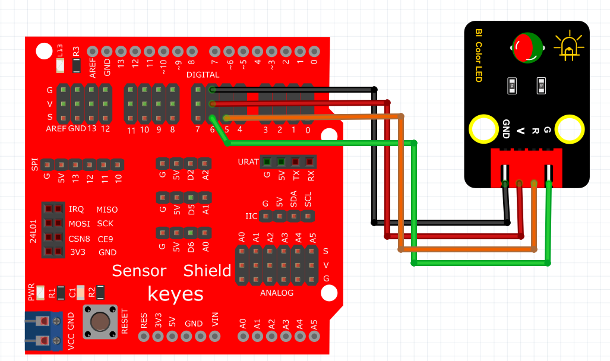

# Arduino

### 1. Arduino编程软件介绍

**Arduino**是一种开放源代码电子原型平台，结合了可编程的微控制器和易于使用的硬件和软件。Arduino IDE提供了一个简洁的编程环境，使得开发者能够轻松编写代码并上传到Arduino板上，实现各种电子项目。

Arduino编程使用一种基于C/C++的语言，适合初学者和专业人士。其广泛应用于教育、创客项目、物联网设备和电子艺术等领域，能够快速实现从简单到复杂的电子控制和传感器应用。

---

### 2. 连接图



### 3. 测试代码

```cpp
int redPin = 5; // R 红色LED 控制引脚 连接到Arduino的 5脚
int greenPin = 6; // G绿色LED 控制引脚 连接到Arduino的6脚

void setup() {
    pinMode(redPin, OUTPUT); // 设置redPin对应的管脚5为输出
    pinMode(greenPin, OUTPUT); // 设置greenPin，对应的管脚6为输出
}

void loop() {
    digitalWrite(redPin, HIGH); // 点亮红色LED
    delay(1000); // 延迟1秒
    digitalWrite(redPin, LOW); // 熄灭红色LED
    digitalWrite(greenPin, HIGH); // 点亮绿色LED
    delay(1000); // 延迟1秒
    digitalWrite(greenPin, LOW); // 熄灭绿色LED
    delay(1000); // 停止显示1秒
}
```

### 4. 测试结果

按照上图接好线，烧录好代码，上电后，RGB模块会陆续显示红色1秒，绿色1秒，停止显示1秒，然后循环交替。

### 5. 加强训练

在前面的代码中，我们学会了控制双色LED灯单独点亮。接下来，我们将尝试利用红色与绿色调节出其他的颜色。

**代码示例：**

```cpp
int redPin = 5; // R 红色LED 控制引脚 连接到Arduino的5脚
int greenPin = 6; // G绿色LED 控制引脚 连接到Arduino的6脚

void setup() {
    pinMode(redPin, OUTPUT); // 设置redPin对应的管脚5为输出
    pinMode(greenPin, OUTPUT); // 设置greenPin，对应的管脚6为输出
}

void loop() {
    // Basic colors:
    color(255, 255); // 亮橙色
    delay(1000); // 延时一秒
}

void color(unsigned char red, unsigned char green) { // 颜色控制函数
    analogWrite(redPin, red);
    analogWrite(greenPin, green);
}
```

**结果：**上传代码后，红光与绿光会混合出黄光。

