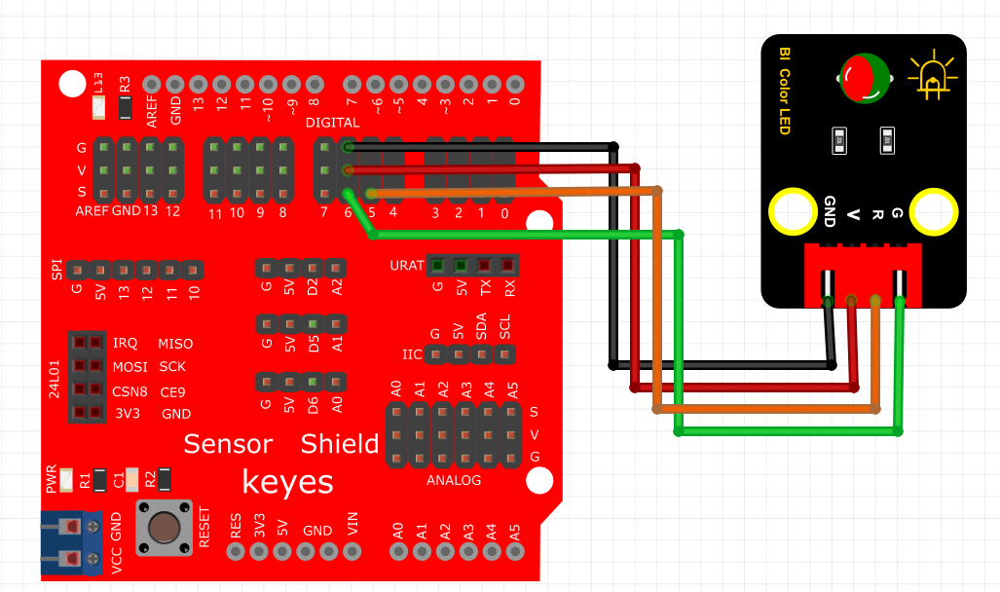
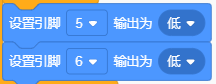
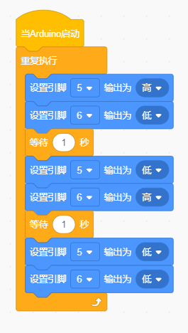
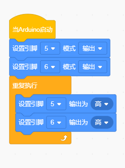

# Kidsblock

### 1. Kidsblock图形化编程软件介绍

**Kidsblock**是一款友好的图形化编程软件，专为初学者和儿童设计。它通过简单的拖放式编程方式，使用户快速掌握Arduino开发。软件将编程逻辑以可视化形式呈现，用户可以通过组合不同的模块（如事件、引脚控制、循环等）快速创建程序，而无需深入学习复杂的编程语言。Kidsblock特别适用于教育和自学，提供了直观的开发环境，让编程学习变得轻松有趣。

---

### 2. 连接图

### 3. 测试代码

①在事件栏里拉出“Arduino启动”模块。

②在控制栏拖出重复执行模块。

③在引脚栏拖出两块设置引脚输出模块，一块设置引脚为5，赋值为高电平；另一块设置引脚为6，赋值为低电平（亮红灯）。

④在控制栏里拖出延时模块，设置延时一秒。

⑤在引脚栏拖出两块设置引脚输出模块，一块设置引脚为5，赋值为低电平；另一块设置引脚为6，赋值为高电平（亮绿灯）。

⑥在控制栏里拖出延时模块，设置延时一秒。

⑦在引脚栏拖出两块设置引脚输出模块，一块设置引脚为5，赋值为低电平；另一块设置引脚为6，赋值为低电平（灯熄灭）。

⑧在控制栏里拖出延时模块，设置延时一秒。

完整代码

### 4. 测试结果

按照上图接好线，烧录好代码，上电后，RGB模块会陆续显示红色1秒，绿色1秒，停止显示1秒，然后循环交替。

### 5. 加强训练
在前面的代码中，我们学会了控制双色LED灯单独点亮。接下来尝试利用红色与绿色调节出其他的颜色。

**代码示例：**

**结果：**上传代码后，红光与绿光会混合出黄光。

