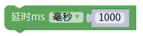

# Mixly

### 1. Mixly图形化编程软件介绍

**Mixly**是一款开源的图形化编程软件，为初学者和教育工作者提供了一种简单易用的编程环境。用户可以通过可视化的模块界面，轻松地拖拽不同的编程块来搭建程序，从而控制各种硬件，例如LED灯、传感器等。Mixly特别适用于教育，能够帮助学生和初学者快速学习编程概念并实现他们的创意项目。

---

### 2. 连接图

### 3. 测试代码

①在输入/输出栏拖出两块模拟输出模块，一块设置引脚为5，赋值为高电平；另一块设置引脚为6，赋值为低电平（亮红灯）。

②在控制栏里拖出延时模块，设置延时一秒。

③在输入/输出栏拖出两块模拟输出模块，一块设置引脚为5，赋值为低电平；另一块设置引脚为6，赋值为高电平（亮绿灯）。

④在控制栏里拖出延时模块，设置延时一秒。

⑤在输入/输出栏拖出两块模拟输出模块，一块设置引脚为5，赋值为低电平；另一块设置引脚为6，赋值为低电平（灯熄灭）。

⑥在控制栏里拖出延时模块，设置延时一秒。

完整代码

### 4. 测试结果

按照上图接好线，烧录好代码，上电后，RGB模块会陆续显示红色1秒，绿色1秒，停止显示1秒，然后循环交替。

### 5. 加强训练

在前面的代码中，我们学会了控制双色LED灯单独点亮。接下来，我们尝试利用红色与绿色调节出其他的颜色。

**代码示例：**

**结果：**上传代码后，红光与绿光会混合出黄光。

