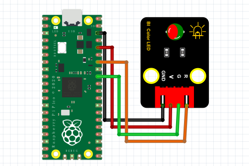

# Python

### 1. MicroPython编程软件介绍

**MicroPython**是一个旨在运行在微控制器和嵌入式系统上的Python编程语言的实现。它设计用于在资源有限的设备上运行，并提供了一种与硬件直接交互的简便方法。MicroPython不仅支持Python的常见功能，还提供了用于控制硬件的API，使得在开发板（如树莓派Pico）上的编程变得简单直观。

MicroPython适合于教育、原型开发和物联网应用，能够帮助开发者和学生快速实现硬件控制和信号处理。

---

### 2. 连接图



### 3. 测试代码

```python
import machine
import utime

led_green = machine.Pin(27, machine.Pin.OUT)
led_red = machine.Pin(26, machine.Pin.OUT)

while True:
    led_red.value(1)
    utime.sleep(1)
    led_red.value(0)
    led_green.value(1)
    utime.sleep(1)
    led_green.value(0)
    utime.sleep(1)
```

### 4. 代码介绍

- **import machine**  
  机器库包含MicroPython需要与Pico和其他MicroPython兼容的设备通信的所有指令，扩展了物理计算的语言。

- **import utime**  
  “utime”库处理所有与时间有关的操作，从测量时间到在程序中插入延迟，单位为秒。

- **led_green = machine.Pin(27, machine.Pin.OUT)**  
  第一个参数27是您正在设置的引脚编号；第二个参数`machine.Pin.OUT`告诉Pico，该引脚应作为输出使用。

- **utime.sleep(1)**  
  这调用utime库中的sleep函数，暂停程序您指定的秒数——在本例中为1秒。

### 5. 测试结果

按照上图接好线，烧录好代码，上电后，RGB模块会陆续显示红色1秒，绿色1秒，停止显示1秒，然后循环交替。

### 6. 加强训练
在前面的代码中，我们学会了控制双色LED灯单独点亮。接下来尝试利用红色与绿色调节出其他的颜色。

**代码示例：**

```python
import machine
import utime

led_green = machine.Pin(27, machine.Pin.OUT)
led_red = machine.Pin(26, machine.Pin.OUT)

while True:
    led_red.value(1)
    led_green.value(1)
```

**结果：**上传代码后，红光与绿光会混合出黄光。

